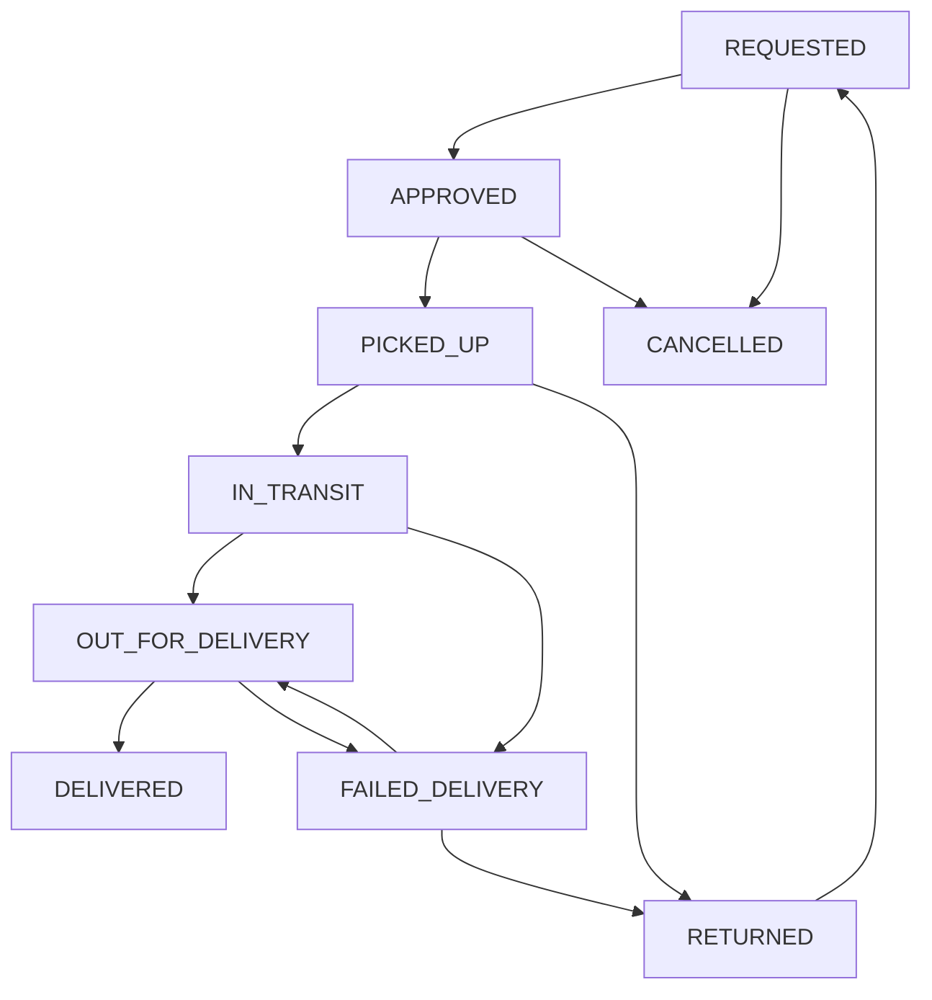

# Dropollo: Parcel Delivery System API

A secure, modular, and role-based backend system designed to facilitate parcel delivery operations similar to Pathao Courier or Sundarban. The system enables users to register as senders or receivers and perform comprehensive parcel management operations including creation, tracking, status updates, and delivery confirmation.

## 🚀 Features

- **Secure Authentication**: JWT-based authentication with password hashing
- **Role-Based Access Control**: Admin, Sender, and Receiver roles with specific permissions
- **Parcel Lifecycle Management**: Complete parcel tracking from creation to delivery
- **Status Tracking**: Detailed status history with embedded logs
- **Business Rule Enforcement**: Validated status transitions and access controls
- **Real-time Tracking**: Public tracking endpoint for parcel status
- **Fee Calculation**: Automated pricing based on weight, urgency, and distance

## 🛠️ Technology Stack

| Category           | Technology    | Purpose                       |
| ------------------ | ------------- | ----------------------------- |
| **Runtime**        | Node.js       | Server runtime environment    |
| **Framework**      | Express.js    | Web application framework     |
| **Language**       | TypeScript    | Type-safe development         |
| **Database**       | MongoDB       | Document database             |
| **ODM**            | Mongoose      | MongoDB object modeling       |
| **Authentication** | JWT           | Token-based authentication    |
| **Security**       | bcrypt        | Password hashing              |
| **Validation**     | Zod           | Schema validation             |
| **Environment**    | dotenv        | Environment configuration     |
| **CORS**           | cors          | Cross-origin resource sharing |
| **Cookie Parsing** | cookie-parser | Cookie handling               |

## 📋 Prerequisites

- Node.js (v18 or higher)
- MongoDB (v6 or higher)
- npm or yarn package manager

## 🚀 Quick Start

### 1. Clone the Repository

```bash
git clone https://github.com/sabbirosa/dropollo-api.git
cd dropollo-api
```

### 2. Install Dependencies

```bash
npm install
```

### 3. Environment Setup

Create a `.env` file in the root directory:

```env
# Server Configuration
PORT=8000
NODE_ENV=development

# Database Configuration
DB_URL=mongodb://localhost:27017/dropollo

# JWT Configuration
JWT_ACCESS_SECRET=your-super-secure-secret-key
JWT_ACCESS_EXPIRES=24h
JWT_REFRESH_SECRET=your-refresh-secret-key
JWT_REFRESH_EXPIRES=7d

# Security Configuration
BCRYPT_SALT_ROUNDS=12

# CORS Allowed Frontend URL
FRONTEND_URL=http://localhost:3000
```

### 4. Database Setup

Ensure MongoDB is running on your system. The application will automatically create the necessary collections when it starts.

### 5. Run the Application

**Development Mode:**

```bash
npm run dev
```

**Production Build:**

```bash
npm run build
npm start
```

The API will be available at `http://localhost:8000`

For Health check go to `http://localhost:8000/api/v1/health`

## 📚 API Endpoints

### Authentication Routes

| Method | Endpoint                    | Description                                                                                                                                                                                                                                     | Access        |
| ------ | --------------------------- | ----------------------------------------------------------------------------------------------------------------------------------------------------------------------------------------------------------------------------------------------- | ------------- |
| `POST` | `/api/auth/register`        | **User Registration**: Creates a new user account with email, password, name, phone, address, and role. Validates unique email, hashes password with bcrypt, and returns user data without password. Default role is 'sender' unless specified. | Public        |
| `POST` | `/api/auth/login`           | **User Login**: Authenticates user with email and password. Compares hashed password, generates JWT access and refresh tokens, sets tokens in HTTP-only cookies, and returns user data with tokens.                                             | Public        |
| `POST` | `/api/auth/refresh-token`   | **Token Refresh**: Validates refresh token and generates new access token to extend user session without requiring re-login.                                                                                                                    | Public        |
| `GET`  | `/api/auth/me`              | **Get Current Profile**: Retrieves authenticated user's complete profile information including personal details, address, and account status. Requires valid JWT token.                                                                         | Authenticated |
| `PUT`  | `/api/auth/profile`         | **Update Profile**: Allows authenticated users to update their personal information including name, phone, and address. Validates input data and returns updated profile.                                                                       | Authenticated |
| `PUT`  | `/api/auth/change-password` | **Change Password**: Enables users to change their password by providing current password and new password. Validates current password, hashes new password, and updates user record.                                                           | Authenticated |
| `POST` | `/api/auth/logout`          | **User Logout**: Clears authentication cookies and invalidates user session. Removes access and refresh tokens from client.                                                                                                                     | Authenticated |

### User Management Routes

#### Admin-Only Routes

| Method   | Endpoint              | Description                                                                                                                                                                                                   |
| -------- | --------------------- | ------------------------------------------------------------------------------------------------------------------------------------------------------------------------------------------------------------- |
| `GET`    | `/api/user/`          | **Get All Users**: Retrieves paginated list of all users in the system with filtering options. Admin can view user details, roles, and account status. Supports search, pagination, and role-based filtering. |
| `GET`    | `/api/user/stats`     | **User Statistics**: Provides comprehensive user analytics including total users, active users, blocked users, role distribution, and registration trends. Used for admin dashboard and reporting.            |
| `GET`    | `/api/user/:id`       | **Get User by ID**: Retrieves detailed information about a specific user including profile data, role, account status, and creation date. Admin can view any user's complete profile.                         |
| `PUT`    | `/api/user/:id/role`  | **Update User Role**: Allows admin to change user roles between 'admin', 'sender', and 'receiver'. Validates role permissions and updates user's access capabilities.                                         |
| `PUT`    | `/api/user/:id/block` | **Block/Unblock User**: Enables admin to block or unblock user accounts. Blocked users cannot access protected routes or perform parcel operations. Includes reason for blocking.                             |
| `DELETE` | `/api/user/:id`       | **Delete User**: Permanently removes user account from the system. Deletes user data and associated records. Cannot be undone.                                                                                |

#### User Profile Routes

| Method | Endpoint                            | Description                                                                                                                                                                      |
| ------ | ----------------------------------- | -------------------------------------------------------------------------------------------------------------------------------------------------------------------------------- |
| `GET`  | `/api/user/profile/me`              | **Get My Profile**: Retrieves current authenticated user's complete profile information including personal details, address, role, and account status.                           |
| `PUT`  | `/api/user/profile/update`          | **Update My Profile**: Allows users to update their personal information including name, phone, address, and other profile details. Validates input and returns updated profile. |
| `PUT`  | `/api/user/profile/change-password` | **Change My Password**: Enables users to change their own password by providing current password verification and new password. Includes password strength validation.           |

### Parcel Management Routes

#### Public Routes

| Method | Endpoint                        | Description                                                                                                                                                                               |
| ------ | ------------------------------- | ----------------------------------------------------------------------------------------------------------------------------------------------------------------------------------------- |
| `GET`  | `/api/parcel/track/:trackingId` | **Track Parcel**: Public endpoint to track parcel status using tracking ID. Returns parcel details, current status, delivery information, and status history. No authentication required. |

#### Sender Routes

| Method   | Endpoint                 | Description                                                                                                                                                                                                                        |
| -------- | ------------------------ | ---------------------------------------------------------------------------------------------------------------------------------------------------------------------------------------------------------------------------------- |
| `POST`   | `/api/parcel/`           | **Create Parcel**: Creates new parcel delivery request with receiver details, parcel specifications, delivery preferences, and urgency level. Auto-generates tracking ID, calculates fees, and sets initial status to 'REQUESTED'. |
| `GET`    | `/api/parcel/my-sent`    | **Get My Sent Parcels**: Retrieves paginated list of all parcels created by the authenticated sender. Includes filtering by status, date range, and search functionality.                                                          |
| `PUT`    | `/api/parcel/:id`        | **Update Parcel**: Allows sender to modify parcel details including receiver information, parcel specifications, and delivery preferences. Only available before parcel is dispatched (REQUESTED or APPROVED status).              |
| `DELETE` | `/api/parcel/:id/cancel` | **Cancel Parcel**: Enables sender to cancel parcel delivery with reason. Only available for parcels in REQUESTED or APPROVED status. Updates status to CANCELLED and maintains cancellation history.                               |

#### Receiver Routes

| Method | Endpoint                           | Description                                                                                                                                                                                                                |
| ------ | ---------------------------------- | -------------------------------------------------------------------------------------------------------------------------------------------------------------------------------------------------------------------------- |
| `GET`  | `/api/parcel/my-received`          | **Get My Received Parcels**: Retrieves paginated list of all parcels addressed to the authenticated receiver. Filters parcels by receiver email and includes status filtering and search.                                  |
| `PUT`  | `/api/parcel/:id/confirm-delivery` | **Confirm Delivery**: Allows receiver to confirm successful delivery of parcel. Updates status to DELIVERED, adds confirmation note, and records delivery timestamp. Only available for parcels addressed to the receiver. |
| `GET`  | `/api/parcel/delivery-history`     | **Get Delivery History**: Retrieves paginated list of successfully delivered parcels for the authenticated receiver. Shows completed deliveries with delivery dates and confirmation details.                              |

#### Admin Routes

| Method   | Endpoint                 | Description                                                                                                                                                                                                               |
| -------- | ------------------------ | ------------------------------------------------------------------------------------------------------------------------------------------------------------------------------------------------------------------------- |
| `GET`    | `/api/parcel/`           | **Get All Parcels**: Retrieves paginated list of all parcels in the system with comprehensive filtering options. Admin can filter by status, sender, receiver, date range, urgency, and tracking ID.                      |
| `PUT`    | `/api/parcel/:id/status` | **Update Parcel Status**: Allows admin to change parcel status following business rules. Validates status transitions, adds status log entry with admin details, and updates current status. Includes location and notes. |
| `PUT`    | `/api/parcel/:id/block`  | **Block/Unblock Parcel**: Enables admin to block or unblock specific parcels. Blocked parcels cannot be updated or processed further. Includes reason for blocking and maintains block history.                           |
| `PUT`    | `/api/parcel/:id/assign` | **Assign Delivery Personnel**: Allows admin to assign delivery personnel to parcels. Includes personnel details like name, email, phone, employee ID, and vehicle information.                                            |
| `GET`    | `/api/parcel/stats`      | **Get Parcel Statistics**: Provides comprehensive parcel analytics including total parcels, delivered count, in-transit count, average delivery time, revenue metrics, and status breakdown.                              |
| `DELETE` | `/api/parcel/:id`        | **Delete Parcel**: Permanently removes parcel from the system. Deletes parcel data, status history, and all associated records. Cannot be undone.                                                                         |

#### Shared Routes (Role-based access)

| Method | Endpoint                         | Description                                                                                                                                                                                                                  |
| ------ | -------------------------------- | ---------------------------------------------------------------------------------------------------------------------------------------------------------------------------------------------------------------------------- |
| `GET`  | `/api/parcel/:id`                | **Get Parcel Details**: Retrieves detailed parcel information including sender, receiver, parcel details, pricing, current status, and delivery information. Access restricted to parcel owner (sender), receiver, or admin. |
| `GET`  | `/api/parcel/:id/status-history` | **Get Status History**: Retrieves complete status history of parcel including all status changes, timestamps, updater information, locations, and notes. Access restricted to parcel owner, receiver, or admin.              |

## 🔄 Parcel Status Flow

The parcel delivery system follows a comprehensive status flow to ensure proper tracking and management:

### Status Transitions



### Status Descriptions

| Status               | Description                           | Who Can Update |
| -------------------- | ------------------------------------- | -------------- |
| **REQUESTED**        | Initial status when parcel is created | System (Auto)  |
| **APPROVED**         | Parcel approved for pickup            | Admin          |
| **PICKED_UP**        | Parcel collected from sender          | Admin          |
| **IN_TRANSIT**       | Parcel in transit to destination      | Admin          |
| **OUT_FOR_DELIVERY** | Parcel out for final delivery         | Admin          |
| **DELIVERED**        | Parcel successfully delivered         | Receiver/Admin |
| **CANCELLED**        | Parcel cancelled (terminal state)     | Sender/Admin   |
| **RETURNED**         | Parcel returned to sender             | Admin          |
| **FAILED_DELIVERY**  | Delivery attempt failed               | Admin          |

### Business Rules

- **Senders** can only cancel parcels in `REQUESTED` or `APPROVED` status
- **Receivers** can only confirm delivery for parcels addressed to them
- **Admins** can update status at any stage and assign delivery personnel
- **Blocked users** cannot create new parcels or update existing ones
- **Status history** is maintained with timestamps and updater information

## 👥 User Roles & Permissions

### Admin

- View and manage all users and parcels
- Block or unblock users and parcels
- Update parcel delivery statuses
- Assign delivery personnel
- Access system-wide analytics and reports
- Full CRUD operations on all resources

### Sender

- Create parcel delivery requests
- Cancel parcels (only if not dispatched)
- View all their created parcels
- Track parcel status and history
- Update parcel details (before dispatch)

### Receiver

- View incoming parcels addressed to them
- Confirm parcel delivery receipt
- Access delivery history
- Track parcel status

## 🔐 Security Features

- **JWT Authentication**: Secure token-based authentication
- **Password Hashing**: bcrypt with salt rounds ≥ 12
- **Role-Based Access Control**: Granular permissions per role
- **Input Validation**: Zod schema validation for all inputs
- **CORS Protection**: Configurable cross-origin resource sharing
- **Rate Limiting**: Protection against abuse
- **Error Handling**: Comprehensive error responses

## 📊 Data Models

### User Schema

```typescript
interface IUser {
  _id: ObjectId;
  name: string;
  email: string; // unique
  password: string; // hashed
  phone: string;
  address: {
    street: string;
    city: string;
    state: string;
    zipCode: string;
    country: string;
  };
  role: "admin" | "sender" | "receiver";
  isBlocked: boolean;
  createdAt: Date;
  updatedAt: Date;
}
```

### Parcel Schema

```typescript
interface IParcel {
  _id: ObjectId;
  trackingId: string; // Format: TRK-YYYYMMDD-XXXXXX
  sender: ObjectId; // Reference to User
  receiver: {
    name: string;
    email: string;
    phone: string;
    address: Address;
  };
  parcelDetails: {
    type: "document" | "package" | "fragile" | "electronics" | "other";
    weight: number; // in kg
    dimensions?: Dimensions;
    description: string;
    value?: number;
  };
  deliveryInfo: {
    preferredDeliveryDate?: Date;
    deliveryInstructions?: string;
    urgency: "standard" | "express" | "urgent";
  };
  pricing: {
    baseFee: number;
    weightFee: number;
    urgencyFee: number;
    totalFee: number;
    discount?: number;
    couponCode?: string;
  };
  currentStatus: ParcelStatus;
  statusHistory: IStatusLog[]; // Embedded status logs
  isBlocked: boolean;
  isCancelled: boolean;
  deliveryPersonnel?: IDeliveryPersonnel;
  createdAt: Date;
  updatedAt: Date;
}
```

## 🧪 Testing

### API Testing

The project includes comprehensive API testing capabilities:

```bash
# Run linting
npm run lint

# Build for production
npm run build

# Start production server
npm start
```

### Postman Collection

A Postman collection is available at [Postman Collection](https://github.com/sabbirosa/dropollo-api/blob/main/v1_api_postman_collection.json) to test all API endpoints.
